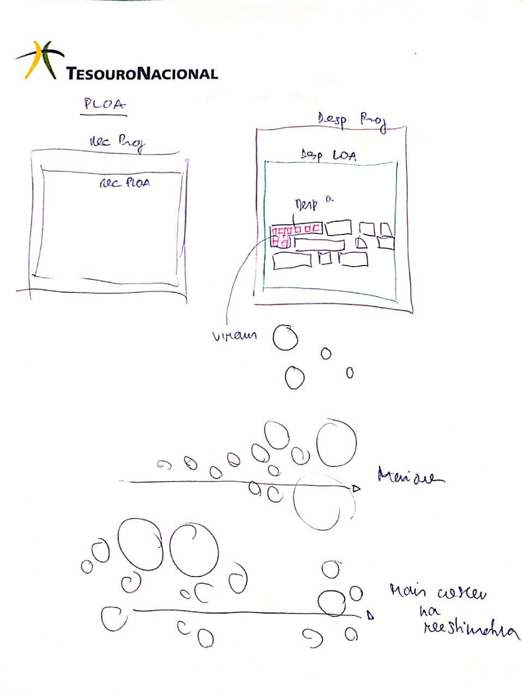

# Relatório Bimestral

Uma ideia inicial

1. Metáfora dos quadradinhos, cada R$ 1 bi representado por um quadradinho. Cada despesa representada por seu valor, na forma de quadradinhos contíguos.
2. Contorno do conjunto dos quadradinhos: despesa e receita totais. Superpõe, mostra déficit.
3. Separa de novo, mostra nova estimativa. Superpõe de novo, mostra novo déficit.
4. Separa. Pinta (?) categorias, depois contorna os grupos de quadradinhos. Somecom os quadradinhos. Permite hover.
5. Modo analítico: converte formas em círculos.
6. Permite visualizar principais variações absolutas e percentuais. Permite visualizar maiores valores.



Vamos precisar de muitas cores, então vale dar uma olhada nesse texto da Lisa:

https://blog.datawrapper.de/10-ways-to-use-fewer-colors-in-your-data-visualizations/

https://github.com/veltman/flubber


## Patterns

Uma ideia: para não ter que desenhar os milhares de rects e estrangular a memória do browser, posso preencher as formas com um padrão de quadradinhos!

Para l = 30 e um gap de 10 entre os quadrados, usaria algo assim:

```html
<defs>             
    <pattern id="Pattern" x="5" y="5" width="40" height="40" patternUnits="userSpaceOnUse">
        <rect x="5" y="5" width="30" height="30" fill="hotpink"/>
    </pattern>
</defs>
```

x = x0 = gap/2.
width = gap/2 + l + gap/2
no rect:
x = gap/2.
width = l.

E, no CSS do path: 

```css
path {
    fill: url(#Pattern);
}
```

Aí depois eu cobriria os paths da despesa e receita total com os paths dos agrupamentos.


