# Relatório Bimestral

## Log

Adaptado para o caso de resultado positivo. Ainda é preciso corrigir:
- referências no texto;
- a questão da meta de ZERO
- o tamanho das receitas (passa do container)
- quando o resultado é positivo, as receitas sobrepõem as despesas

## Sobre o projeto

Olá! Este é o repositório de uma história de dados sobre o Relatório Bimestral, um relatório bastante técnico, mas que possui informações bem interessantes. Por isso pensamos em tentar criar algo mais acessível, didático e... divertido, por que não?

A história foi toda montada usando apenas HTML, CSS e (vanilla) Javascript, com um pouco de D3 para o diagrama de força.

Para a preparação dos dados, utilizamos R.

Existe bastante espaço para otimização, ainda não estamos satisfeitos com o tempo inicial de processamento para o cálculo das formas, principalmente para os grandes valores, que poderiam ser bastante simplificados. O prazo não permitiu, mas quem sabe no futuro?

O resto deste readme é basicamente um brainstorm de ideias desconexas, e alguns rascunhos.

## Uma ideia inicial

1. Metáfora dos quadradinhos, cada R$ 1 bi representado por um quadradinho. Cada despesa representada por seu valor, na forma de quadradinhos contíguos.
2. Contorno do conjunto dos quadradinhos: despesa e receita totais. Superpõe, mostra déficit.
3. Separa de novo, mostra nova estimativa. Superpõe de novo, mostra novo déficit.
4. Separa. Pinta (?) categorias, depois contorna os grupos de quadradinhos. Somecom os quadradinhos. Permite hover.
5. Modo analítico: converte formas em círculos.
6. Permite visualizar principais variações absolutas e percentuais. Permite explorar itens individualmente, trazendo uma espécie de "card" com mais detalhes sobre aquele item, incluindo as justificativas que estão no corpo do relatório.

## Rascunhos

O primeiro rascunho


Detalhando a ideia inicial um pouco mais...

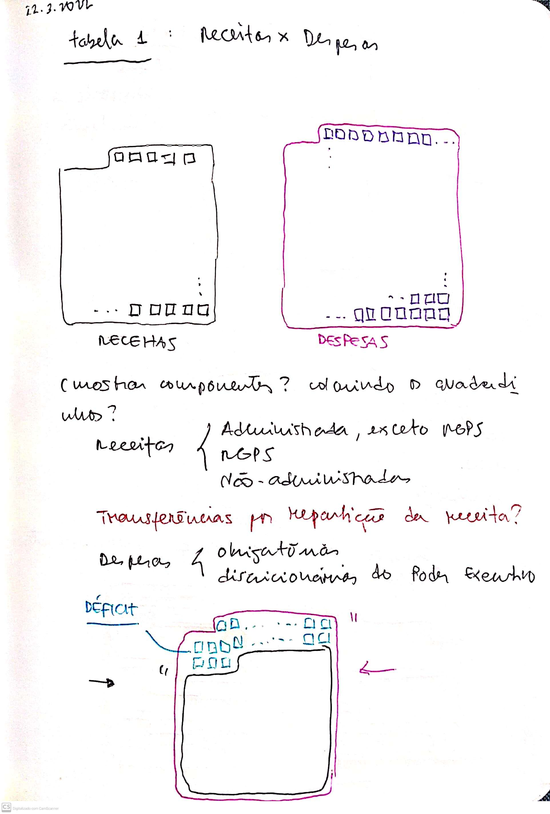

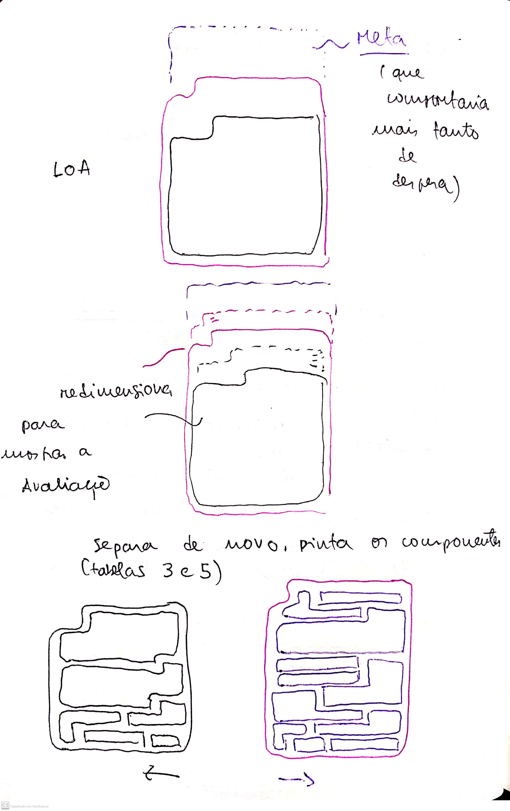

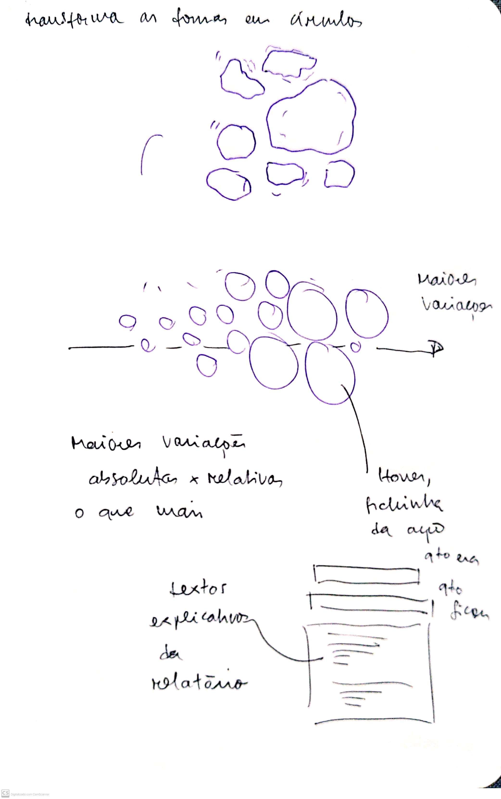

Mas como calcular as formas geométricas?

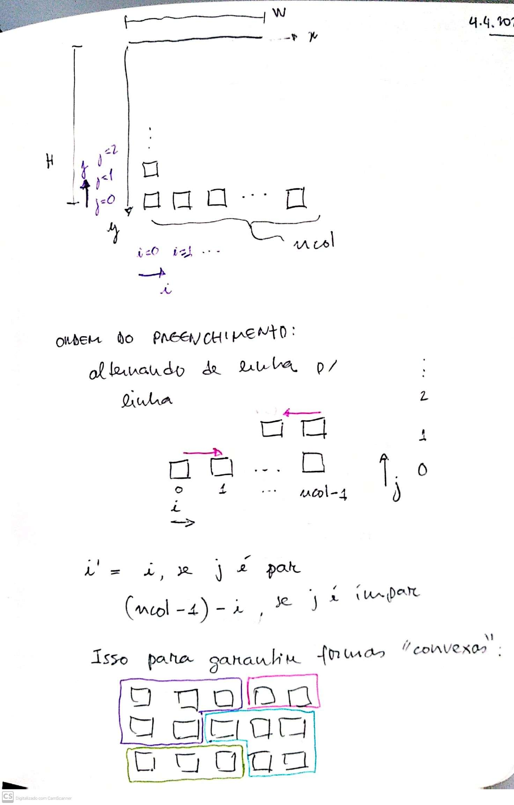

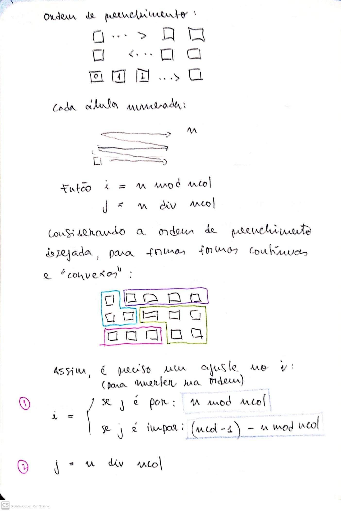

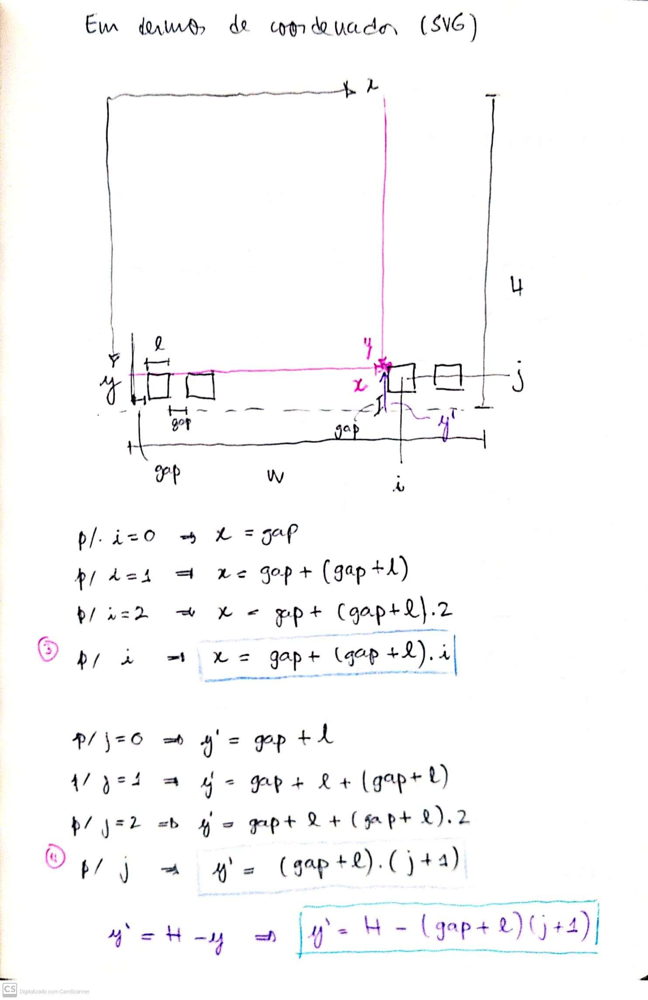

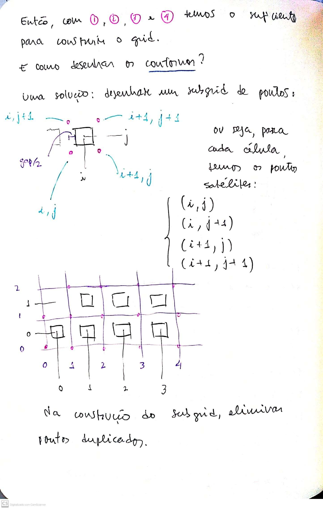

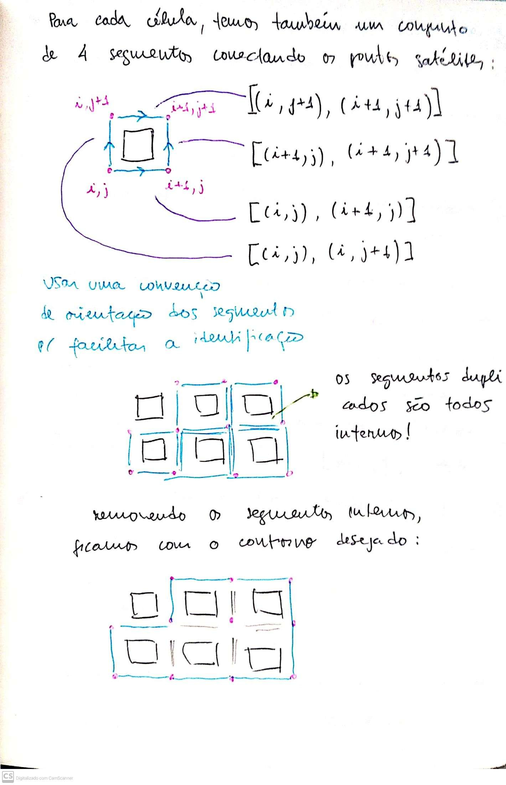

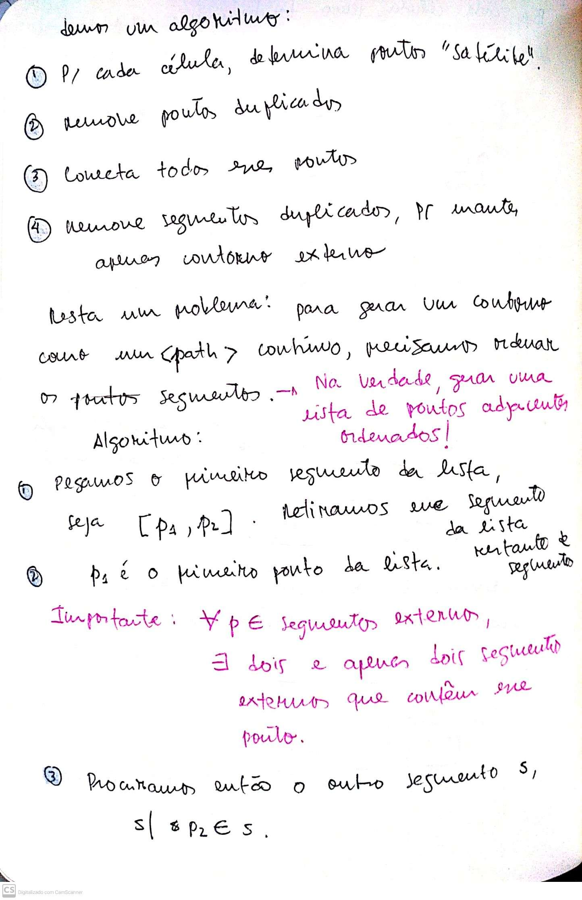

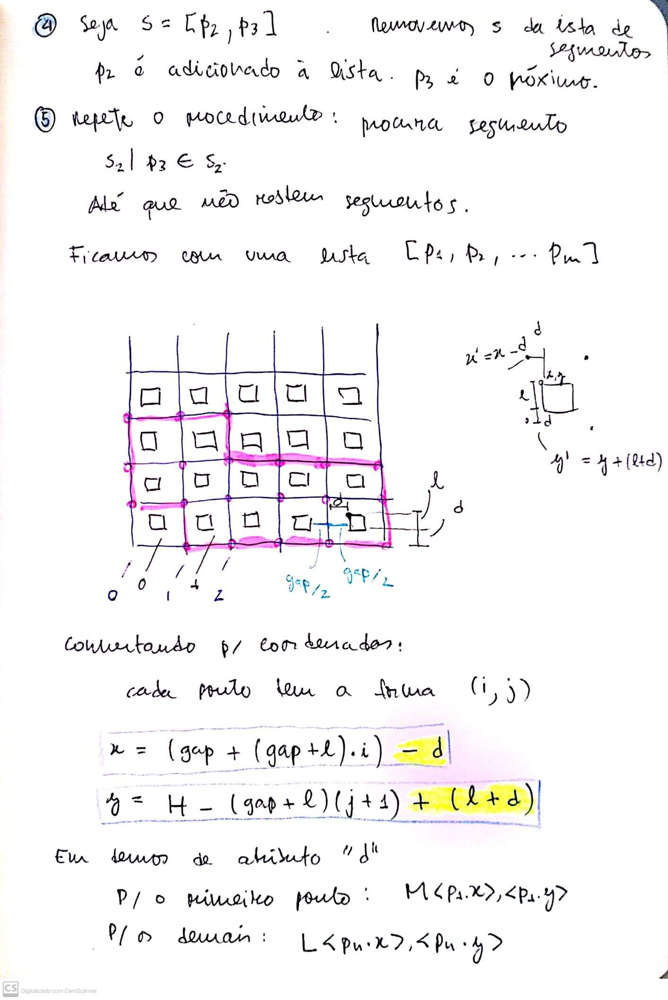

Protótipo da implementação do algoritmo

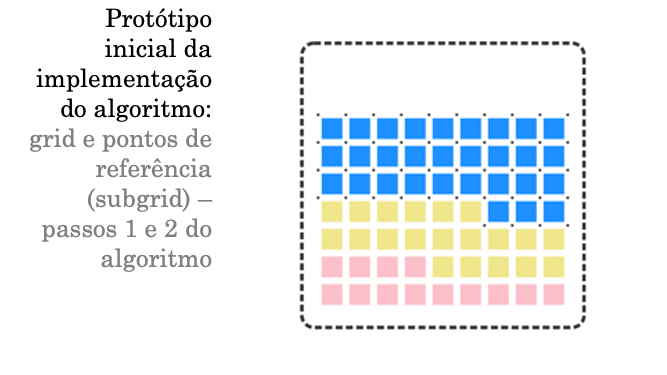

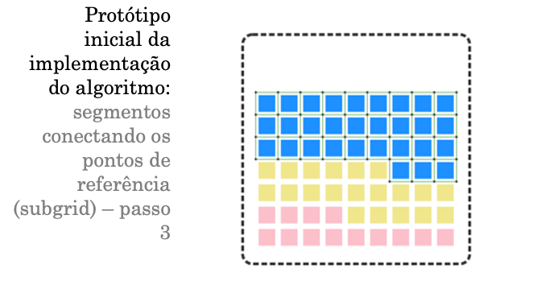

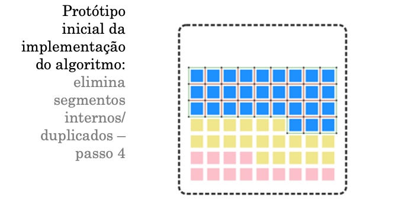

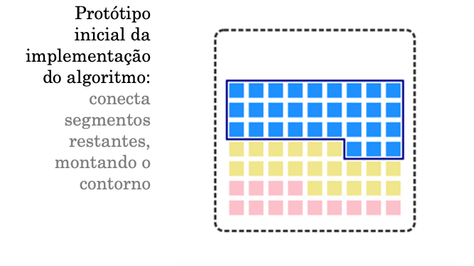


Vamos precisar de muitas cores, então vale dar uma olhada nesse texto da Lisa:

https://blog.datawrapper.de/10-ways-to-use-fewer-colors-in-your-data-visualizations/

https://github.com/veltman/flubber


## Patterns em SVG

Uma ideia: para não ter que desenhar os milhares de rects e estrangular a memória do browser, posso preencher as formas com um padrão de quadradinhos!

Para l = 30 e um gap de 10 entre os quadrados, usaria algo assim:

```html
<defs>             
    <pattern id="Pattern" x="5" y="5" width="40" height="40" patternUnits="userSpaceOnUse">
        <rect x="5" y="5" width="30" height="30" fill="hotpink"/>
    </pattern>
</defs>
```

x = x0 = gap/2.
width = gap/2 + l + gap/2
no rect:
x = gap/2.
width = l.

E, no CSS do path: 

```css
path {
    fill: url(#Pattern);
}
```

Aí depois eu cobriria os paths da despesa e receita total com os paths dos agrupamentos.

1. os objetos são criados.
2. `obj.esconde(false)` faz eles aparecerem
3. `obj.move_para('centro' | 'esquerda' | 'direita')`

# Fazer

Melhorar objetos scales e eixos
Parametrizar o strength (hoje está repetindo na função que seta a simulação e na que altera)
Incluir dados receitas
tooltip

# Texto

Para um lar, uma empresa ou um governo funcionar, é preciso de dinheiro. O dinheiro precisa vir de algum lugar, e esse dinheiro vai ser usado para pagar por bens e serviços.

Para um lar, uma empresa ou um governo continuar funcionando, é preciso que haja um equilíbrio entre o dinheiro que entra (receitas) e o dinheiro que sai (despesas).

Para alcançar esse equilíbrio ao longo do tempo, é importante planejar e monitorar essas receitas e despesas.

Para ajudar a manter esse equilíbrio, ou ao menos para manter eventuais desequilíbrios sob controle, o governo todo ano estabelece metas anuais de receitas, despesas e resultados &mdash; a diferença entre receita e despesas.

Uma das ferramentas para acompanhar essas metas é o Relatório de Avaliação de Receitas e Despesas Primárias, publicado bimestralmente &mdash; daí ser conhecido como "O Bimestral".

Esse relatório traz informações sobre as receitas e despesas previstas, e o seus valores após a reavaliação bimestral, com as respectivas justificativas. O relatório inicialmente mostra os grandes valores das receitas e despesas, e em seguida detalha os componentes desses grandes itens.

## Os grandes números

A Lei Orçamentária de 2022 previa uma arrecadação de R$... 

Com esse objetivo, o governo todo ano define metas anuais de receitas, despesas e resultados

O equilíbrio
Todo ano, o governo estabelece metas anuais de receitas e despesas e resultados.

O relatório de avaliação de receitas e despesas é um instrumento

art. 64, parágrafo 4o.